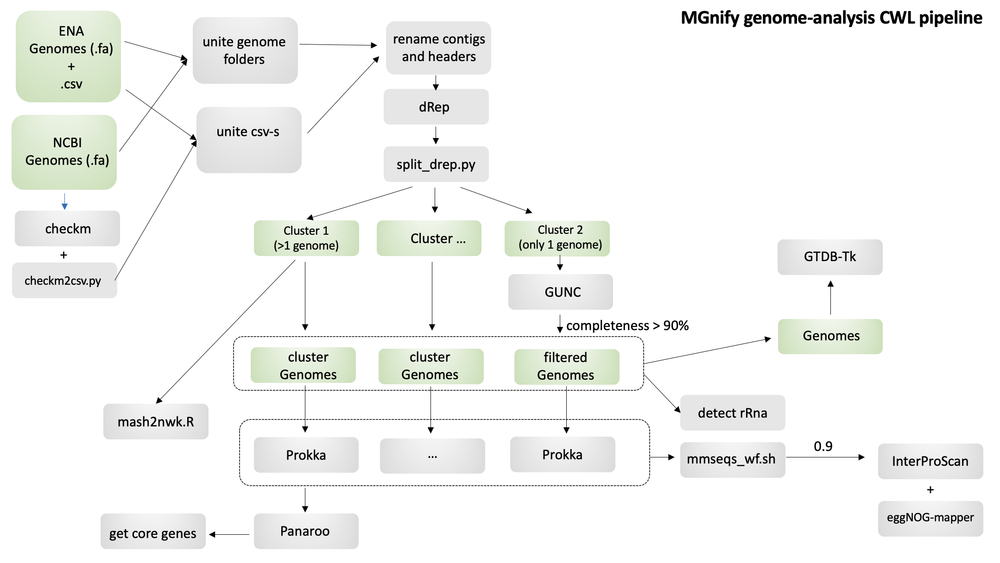

# MGnify genome analysis pipeline

MGnify CWL pipeline to characterize a set of isolate or metagenome-assembled genomes (MAGs) using the workflow described in the following publication: 

A Almeida, S Nayfach, M Boland, F Strozzi, M Beracochea, ZJ Shi, KS Pollard, E Sakharova, DH Parks, P Hugenholtz, N Segata, NC Kyrpides and RD Finn. [A unified catalog of 204,938 reference genomes from the human gut microbiome.](https://www.nature.com/articles/s41587-020-0603-3) <i>Nature Biotechnol</i>. doi: https://doi.org/10.1038/s41587-020-0603-3

## Installation

1. Install the necessary dependencies:
- [cwltool](https://github.com/common-workflow-language/cwltool) (tested v1.0.2)
- [R](https://www.r-project.org/) (tested v3.5.2). Packages: reshape2, fastcluster, optparse, data.table and ape.
- [Python](https://www.python.org/) v2.7 and v3.6
- [CheckM](https://github.com/Ecogenomics/CheckM) (tested v1.0.11)
- [CAT](https://github.com/dutilh/CAT) (tested v5.0)
- [GTDB-Tk](https://github.com/Ecogenomics/GTDBTk) (tested v0.3.1 and v1.0.2)
- [dRep](https://drep.readthedocs.io/en/latest/) (tested v2.2.4)
- [Prokka](https://github.com/tseemann/prokka) (tested 1.14.0)
- [Roary](https://sanger-pathogens.github.io/Roary/) (tested 3.12.0)
- [MMseqs2](https://github.com/soedinglab/MMseqs2) (tested v8-fac81)
- [InterProScan](https://github.com/ebi-pf-team/interproscan/wiki) (tested v5.35-74.0 and v5.38-76.0)
- [eggNOG-mapper](https://github.com/eggnogdb/eggnog-mapper/wiki/eggNOG-mapper-v2) (tested v2.0)

2. Make sure all these tools, as well as the <b>custom_scripts/</b> folder, are added to your `$PATH` environment.

3. Edit <b>custom_scripts/taxcheck.sh</b> to point CAT to the installed diamond and database paths (variables `$diamond_path`, `$cat_db_path` and `$cat_tax_path`)

## How to run

1. Add path of input genomes folder to YML file: <b>workflows/yml_patterns/wf-1.yml</b>

2. Run first workflow with: \
`cwltool workflows/wf-1.cwl workflows/yml_patterns/wf-1.yml > output-wf-1.json` \
Output json will be saved to a separate file.

3. Run parser of output json \
`python3 workflows/parser_yml.py -j output-wf-1.json -y workflows/yml_patterns/wf-2.yml`

4. Check exit code of parser \
`echo $?`

5. If exit code == 1, run: \
`cwltool workflows/wf-exit-1.cwl workflows/yml_patterns/wf-2.yml` \
If exit code == 2, run: \
`cwltool workflows/wf-exit-2.cwl workflows/yml_patterns/wf-2.yml` \
If exit code == 3, run: \
`cwltool workflows/wf-exit-3.cwl workflows/yml_patterns/wf-2.yml` \
Note: You can manually change parameters of MMseqs2 for protein clustering in <b>workflows/yml_patterns/wf-2.yml</b>

Output files/folders:
- checkm_quality.csv
- gtdb-tk_output/
- taxcheck_output/
- mmseqs_output/
- mash_trees/
- cluster__X
- cluster__...

## Pipeline structure

### Tool description
- CheckM: Estimate genome completeness and contamination.
- TaxCheck: Wrapper of the contig annotation tool (CAT) to predict taxonomy consistency across contigs.
- GTDB-Tk: Genome taxonomic assignment using the GTDB framework.
- dRep: Genome de-replication.
- Mash2Nwk: Generate Mash distance tree of conspecific genomes.
- Prokka: Predict protein-coding sequences from genome assembly.
- Roary: Infer pan-genome from a set of conspecific genomes.
- MMseqs2: Cluster protein-coding sequences.
- InterProScan: Protein functional annotation using the InterPro database.
- eggNOG-mapper: Protein functional annotation using the eggNOG database.

### Part 1 (quality control, clustering and taxonomic assignment): **wf-1.cwl**

    1.1) checkm 
    1.2) checkm2csv 
    1.3) dRep 

    1.4.1) GTDB-Tk

    1.4.2) split_drep.py
    1.5) classify_folders.py

    2) taxcheck

output: 
 - checkm_csv
 - gtdbtk folder
 - taxcheck_dirs \
**plus folders for the next step**
 - one_genome (list of clusters/folders that have only one genome)
 - many_genomes (list of clusters/folders that have more than one genome)
 - mash_folder (list of mash-files from "many_genomes" clusters)

### Part 2 (functional annotation)
Check \
======> if many_genomes and one_genome present: **run wf-exit-1.cwl**

        **2.1. For many_genomes part**
            
            1) Prokka
            2) Roary
            3) translate from fa to faa
            4.1) IPS
            4.2) EggNOG
            
        output: OUTPUT_MANY
         - mash_trees
         - cluster folder(-s)
         - prokka concatenated faa result
         
         
        **2.2. For one_genome part** 
        
            1) Prokka
            2.1) IPS
            2.2) EggNOG
            
        output: OUTPUT_ONE
         - cluster folder(-s)
         - prokka concatenated faa result

        **2.3. Final part**   
        
            1) cat prokka from many and one
            2) mmseqs 
        output: OUTPUT_3
         - mmseqs folder
    
======> if many_genomes present BUT one_genome NOT present: **run wf-exit-2.cwl**    
Step 2.1 + 2.3

======> if many_genomes NOT present BUT one_genome present: **run wf-exit-3.cwl**    
Step 2.2 + 2.3

### Part 3 (clean-up)
Copies all relevant output to one result folder
