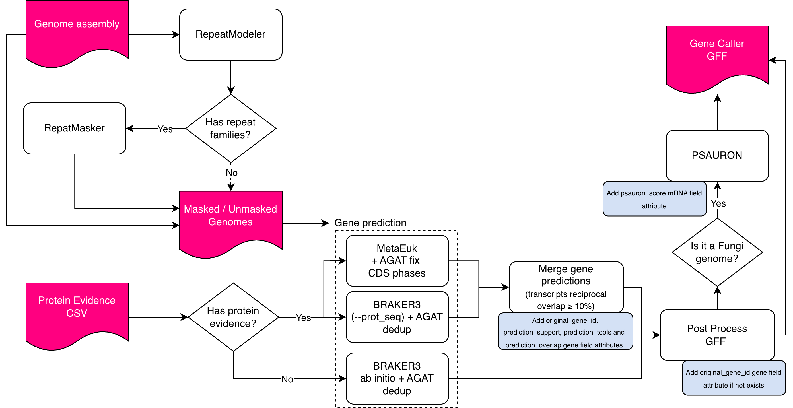

# MGnify genomes catalogue pipeline

[MGnify](https://www.ebi.ac.uk/metagenomics/) A pipeline to perform taxonomic and functional annotation and to generate a catalogue from a set of isolate and/or metagenome-assembled genomes (MAGs) using the workflow described in the following publication:

Gurbich TA, Almeida A, Beracochea M, Burdett T, Burgin J, Cochrane G, Raj S, Richardson L, Rogers AB, Sakharova E, Salazar GA and Finn RD. (2023) [MGnify Genomes: A Resource for Biome-specific Microbial Genome Catalogues.](https://www.sciencedirect.com/science/article/pii/S0022283623000724) <i>J Mol Biol</i>. doi: https://doi.org/10.1016/j.jmb.2023.168016

Detailed information about existing MGnify catalogues: https://docs.mgnify.org/src/docs/genome-viewer.html

### Tools used in the pipeline
| Tool/Database                                                                                    | Version          | Purpose                                                                                                                |
|--------------------------------------------------------------------------------------------------|------------------|------------------------------------------------------------------------------------------------------------------------|
| CheckM2                                                                                          | 1.1.0            | Determining genome quality                                                                                             |
| CheckM2 DB                                                                                       | V3               | DIAMOND database for CheckM2                                                                                           |
| dRep                                                                                             | 3.2.2            | Genome clustering                                                                                                      |
| Mash                                                                                             | 2.3              | Sketch for the catalogue; placement of genomes into clusters (update only); strain tree                                |
| GUNC                                                                                             | 1.0.6            | Quality control                                                                                                        |
| GUNC DB                                                                                          | 2.0.4            | Database for GUNC                                                                                                      |
| GTDB-Tk                                                                                          | 2.4.1            | Assigning taxonomy; generating alignments                                                                              |
| GTDB                                                                                             | r226             | Database for GTDB-Tk                                                                                                   |
| Prokka                                                                                           | 1.14.6           | Protein annotation                                                                                                     |
| IQ-TREE 2                                                                                        | 2.2.0.3          | Generating a phylogenetic tree                                                                                         |
| Kraken 2                                                                                         | 2.1.2            | Generating a kraken database                                                                                           |
| Bracken                                                                                          | 2.6.2            | Generating a bracken database                                                                                          |
| MMseqs2                                                                                          | 13.45111         | Generating a protein catalogue                                                                                         |
| eggNOG-mapper                                                                                    | 2.1.11           | Protein annotation (eggNOG, KEGG, COG,  CAZy)                                                                          |
| eggNOG DB                                                                                        | 5.0.2            | Database for eggNOG-mapper                                                                                             |
| DIAMOND                                                                                          | 2.0.11           | Protein annotation (eggNOG)                                                                                            |
| InterProScan                                                                                     | 5.76-107.0       | Protein annotation (InterPro, Pfam)                                                                                    |
| kegg-pathways-completeness tool                                                                  | 1.3.0            | Computes KEGG pathway completeness                                                                                     |
| CRISPRCasFinder                                                                                  | 4.3.2            | Annotation of CRISPR arrays                                                                                            |
| AMRFinderPlus                                                                                    | 4.0.23           | Antimicrobial resistance gene annotation; virulence factors, biocide, heat, acid, and metal resistance gene annotation |
| AMRFinderPlus DB                                                                                 | 4.0 2025-07-16.1 | Database for AMRFinderPlus                                                                                             |
| antiSMASH                                                                                        | 7.1.0            | Biosynthetic gene cluster annotation                                                                                   |
| GECCO                                                                                            | 0.9.8            | Biosynthetic gene cluster annotation                                                                                   |
| SanntiS                                                                                          | 0.9.3.2          | Biosynthetic gene cluster annotation                                                                                   |
| DefenseFinder                                                                                    | 2.0.0            | Annotation of anti-phage and anti-defense systems                                                                      |
| DefenseFinder models                                                                             | 2.0.2            | Database for DefenseFinder                                                                                             |
| CasFinder                                                                                        | 3.1.0            | Database for DefenseFinder                                                                                             |
| run_dbCAN                                                                                        | 4.1.4            | Polysaccharide utilization loci prediction                                                                             |
| dbCAN DB                                                                                         | V13              | Database for run_dbCAN                                                                                                 |
| Infernal                                                                                         | 1.1.4            | RNA predictions                                                                                                        |
| tRNAscan-SE                                                                                      | 2.0.9            | tRNA predictions                                                                                                       |
| Rfam                                                                                             | 15.0             | Identification of SSU/LSU rRNA and other ncRNAs                                                                        |
| Panaroo                                                                                          | 1.3.2            | Pan-genome computation                                                                                                 |
| Seqtk                                                                                            | 1.3              | Generating a gene catalogue                                                                                            |
| VIRify                                                                                           | 3.0.2            | Viral sequence annotation (executed as a separate step and uses VirSorter v1)                                          |
| [Mobilome annotation pipeline](https://github.com/EBI-Metagenomics/mobilome-annotation-pipeline) | 3.0.1            | Mobilome annotation (executed as a separate step)                                                                      |
| samtools                                                                                         | 1.15             | FASTA indexing                                                                                                         |
| EukCC                                                                                            | 2.1.3            | Completeness and contamination of eukaryotic genomes                                                                   |
| BUSCO                                                                                            | 5.8.0            | Eukaryotic genome quality                                                                                              |
| RepeatModeler                                                                                    | 2.0.7            | Identification of repeat elements in eukaryotic genomes                                                                |
| RepeatMasker                                                                                     | 4.2.3            | Repeat masking in eukaryotic genomes                                                                                   |
| BRAKER3                                                                                           | 3.0.8            | Primary source of gene calling in eukaryotic genomes                                                                                     |
| MetaEuk                                                                                          | 7-bba0d80        | Secondary source of gene calling in eukaryotic genomes                                                                                     | 
| AGAT                                                                                             | 1.7.0            | Deduplication of BRAKER3 predictions |
| PSAURON                                                                                          | 1.1.0            | Assessment of protein coding gene annotation in fungi genomes |
| CAT_pack                                                                                         | 5.2.3            | Taxonomic classification of eukaryotic genomes                                                                         |
| CAT_pack DB                                                                                      | 2021-01-07       | DIAMOND database made from NCBI nr and NCBI taxdump used by CAT_pack                                                   |

## Setup

### Environment

The pipeline is implemented in [Nextflow](https://www.nextflow.io/).

Requirements:
- [singularity](https://sylabs.io/docs/) or [docker](https://www.docker.com/)

#### Reference databases

The pipeline needs the following reference databases and configuration files (roughly ~150G):

- ftp://ftp.ebi.ac.uk/pub/databases/metagenomics/genomes-pipeline/gunc_db_2.0.4.dmnd.gz
- ftp://ftp.ebi.ac.uk/pub/databases/metagenomics/genomes-pipeline/eggnog_db_5.0.2.tgz
- ftp://ftp.ebi.ac.uk/pub/databases/metagenomics/genomes-pipeline/rfam_15.0/
- ftp://ftp.ebi.ac.uk/pub/databases/metagenomics/genomes-pipeline/kegg_classes.tsv
- ftp://ftp.ebi.ac.uk/pub/databases/metagenomics/genomes-pipeline/continent_countries.csv
- https://data.ace.uq.edu.au/public/gtdb/data/releases/release226/226.0/auxillary_files/gtdbtk_package/full_package/gtdbtk_r226_data.tar.gz
- ftp://ftp.ncbi.nlm.nih.gov/pathogen/Antimicrobial_resistance/AMRFinderPlus/database/3.12/2024-01-31.1/
- https://zenodo.org/records/4626519/files/uniref100.KO.v1.dmnd.gz

### Containers

This pipeline requires [singularity](https://sylabs.io/docs/) or [docker](https://www.docker.com/) as the container engine to run the pipeline.

The containers are hosted in [biocontainers](https://biocontainers.pro/) and [quay.io/microbiome-informatics](https://quay.io/organization/microbiome-informatics) repositories.

It's possible to build the containers from scratch using the following script:

```bash
cd containers && bash build.sh
```

## Running the pipeline

## Data preparation

1. You need to pre-download your data to directories and make sure that genomes are uncompressed. Scripts to fetch genomes from ENA ([fetch_ena.py](https://github.com/EBI-Metagenomics/genomes-pipeline/blob/master/bin/fetch_ena.py)) and NCBI ([fetch_ncbi.py](https://github.com/EBI-Metagenomics/genomes-pipeline/blob/master/bin/fetch_ncbi.py)) are provided and need to be executed separately from the pipeline. If you have downloaded genomes from both ENA and NCBI, put them into separate folders.

2. When genomes are fetched from ENA using the `fetch_ena.py` script, a CSV file with contamination and completeness statistics is also created in the same directory where genomes are saved to. If you are downloading genomes using a different approach, a CSV file needs to be created manually (each line should be genome accession, % completeness, % contamination). The ENA fetching script also pre-filters genomes to satisfy the QS50 cut-off (QS = % completeness - 5 * % contamination).

3. You will need the following information to run the pipeline:
 - catalogue name (for example, zebrafish-faecal)
 - catalogue version (for example, 1.0)
 - catalogue biome (for example, root:Host-associated:Human:Digestive system:Large intestine:Fecal)
 - min and max accession number to be assigned to the genomes (only MGnify specific). Max - Min = #total number of genomes (NCBI+ENA)

### Eukaryotic genomes: protein evidence for gene prediction

If you are running the pipeline with `--kingdom eukaryotes`, you need to collect protein evidence before running the pipeline. This evidence is used by [Braker](https://github.com/Gaius-Augustus/BRAKER) for gene prediction.

Use [datascout](https://github.com/EBI-Metagenomics/datascout) pipeline to collect the required protein data from OrthoDB:

```bash
nextflow run datascout/main.nf --samplesheet <datascout_input>.csv --download_rna_fastq false
```

The samplesheet with protein evidence should be supplied with `--protein_evidence` parameter. The expected format is a CSV file with two columns — `genome` and `proteins` — mapping each genome filename to its corresponding protein FASTA file. See [assets/datascout_samplesheet.csv](assets/datascout_samplesheet.csv) for an example.

## Execution

The pipeline is built in [Nextflow](https://www.nextflow.io), and utilizes containers to run the software (we don't support conda ATM).
In order to run the pipeline it's required that the user creates a profile that suits their needs, there is an `ebi` profile in `nextflow.config` that can be used as a template.

After downloading the databases and adjusting the config file:

```bash
nextflow run EBI-Metagenomics/genomes-pipeline -c <custom.config> -profile <profile> \
--genome-prefix=MGYG \
--biome="root:Host-associated:Fish:Digestive system" \
--ena_genomes=<path to genomes> \
--ena_genomes_checkm=<path to genomes quality data> \
--mgyg_start=0 \
--mgyg_end=10 \
--preassigned_accessions=<path to file with preassigned accessions if using>
--catalogue_name=zebrafish-faecal \
--catalogue_version="1.0" \
--ftp_name="zebrafish-faecal" \
--ftp_version="v1.0" \
--outdir="<path-to-results>"
```

## Catalogue update process

The pipeline has an update functionality, triggered by the `--update_catalogue_path` argument. The update process
performs the following:
- removes genomes (if a list of accessions to remove is provided or any of the existing genomes are no longer present in the ENA or fail QC)
- adds genomes (if a list of genomes to add is specified)
- reannotates new and existing genomes and recomputes associated databases (in all cases)

While a regular pipeline execution uses dRep to cluster genomes, **the clustering during the update process is different in the following ways**:

- existing clustering from the previous catalogue version is preserved
- the genomes that are flagged for removal (by the user or the pipeline) are removed without disrupting the existing clusters
- if new genomes are being added, their placement is determined using [Mash](https://github.com/marbl/Mash) and the following rules:
  1. if the smallest Mash distance between the new genome and any of the existing catalogue genomes is less than 0.001, the new genome is classified as a repeat strain
  2. if the smallest distance is greater than 0.05, the new genome is classified as a new species
  3. all other new genomes are classified as new strains
  4. a repeat strain is only added to the catalogue in the following cases: 1) if it is an isolate while the closest match in the catalogue is a MAG OR 2) if the quality improvement of the new strain compared to the one in the catalogue is at least 10% (see notes on quality comparison below)
  5. new strains and new species are always added to the catalogue, as long as they pass the general quality control checks used for new genomes

### Quality comparisons for new genomes
During the catalogue cluster update process, the quality scores for all genomes are calculated as:
`QS = % completeness – 5 * % contamination + 0.5 * log(N50)`
A 10% quality improvement is computed as `threshold = QS * 1.1`.
The quality score improvement is used to decide:
- if a repeat strain should be added to the catalogue
- if the species representative genome should be re-assigned.

For threshold values <= 100, the highest quality genome above the threshold is chosen as the new representative.
If threshold > 100, the decision process changes to prioritise genome contiguity. The species representative is replaced if there is a genome that satisfies the following conditions:
- QS and completeness is same or higher than the existing rep
- Contamination is the same or less than the existing rep
- N50 is at least 10% AND 10,000bp higher than that of the existing species rep (to account for small increases to an already low N50 - only a significant increase should justify a replacement)
- The length of the new representative should be at least 90% of the length of the old represenative

An isolate genome is always prioritised over a MAG. That means, if the current representative is an isolate, it can only be replaced with a better quality isolate. If the current species rep is a MAG and an isolate has been added to the cluster, a species representative replacement will be made even if the new genome has lower quality.


## Eukaryotic gene calling

When the pipeline runs with `--kingdom eukaryotes`, protein-coding genes are called by combining two gene callers — **BRAKER3** (primary) and **MetaEuk** (secondary) — and, for fungal genomes, the resulting proteins are scored with **PSAURON**. This is done per genome inside the `EUK_GENE_CALLING` subworkflow.



### Repeat masking

Each genome is run through **RepeatModeler** to build a repeat library. Genomes **with** repeat families are then soft-masked by **RepeatMasker**; genomes with **no** repeat families bypass RepeatMasker and stay unmasked.

### BRAKER3 — primary caller

BRAKER3 runs on **every** genome (soft-masked or not). The per-genome role of the protein evidence supplied via `--protein_evidence` (see [Eukaryotic genomes: protein evidence for gene prediction](#eukaryotic-genomes-protein-evidence-for-gene-prediction)) is:

- if a genome **has** protein evidence, BRAKER3 uses it as hints (`--prot_seq`);
- if a genome has **no** protein evidence (the `NO_PROTEINS.faa` sentinel), BRAKER3 runs ab initio.

BRAKER3 predictions are then deduplicated with **AGAT** (`agat_sp_fix_features_locations_duplicated`), and the protein (`.faa`) and CDS (`.ffn`) sequences are extracted from the deduplicated set.

### MetaEuk — secondary caller

**MetaEuk only runs for genomes that have protein evidence** — it is a protein-to-genome aligner and needs the evidence to predict genes. Genomes without protein evidence skip MetaEuk and use BRAKER3 alone. The CDS phases of the MetaEuk GFF (MetaEuk emits `.`) are recomputed with AGAT (`agat_sp_fix_cds_phases`) and reconciled back onto the original MetaEuk structure.

### Merging the two callers

- **Genomes with protein evidence** → BRAKER3 and MetaEuk are merged into a single consensus set (`merge_gene_predictions.py`): every BRAKER3 gene is kept, MetaEuk genes that do **not** overlap (10% reciprocal overlap) a BRAKER3 gene are added, and BRAKER3 genes that **are** supported by an overlapping MetaEuk gene are flagged (see attributes below).
- **Genomes without protein evidence** → the BRAKER3-only gene set is used directly.

Either way, the gene set is post-processed (`rename_and_process_gene_callers_outputs.py`): gene IDs are renamed to MGYG accessions, a `product=hypothetical protein` is added to CDS that lack one, and the genome FASTA is appended to the GFF (`##FASTA`).

### PSAURON — fungal protein scoring

**PSAURON only runs for Fungi** — genomes whose CAT_pack/BAT taxonomy phylum is `p__Ascomycota` or `p__Basidiomycota`. It scores each predicted protein and writes the score back onto the GFF. Non-fungal genomes skip PSAURON and keep the post-processed GFF unchanged.

### Gene-caller GFF attributes

The merge and PSAURON steps add the following attributes (GFF column 9):

| Attribute | Feature | Added by | Meaning |
|---|---|---|---|
| `original_gene_id` | gene | merge / postprocessing | the gene caller's original ID (e.g. `g42`) before the MGYG renaming |
| `prediction_support` | gene | merge | number of callers supporting the gene (`2` when BRAKER3 and MetaEuk agree) |
| `prediction_tools` | gene | merge | the callers supporting the gene (`BRAKER3,MetaEuk`) |
| `prediction_overlap` | gene | merge | fraction (0–1) of the BRAKER3 transcript covered by the supporting MetaEuk transcript |
| `psauron_score` | mRNA | PSAURON | PSAURON in-frame score of the transcript's protein (fungal genomes only) |

The feature `source` (column 2) reflects the predictor: `AUGUSTUS` / `GeneMark.hmm3` for BRAKER3 genes and `MetaEuk` for MetaEuk-unique genes. `prediction_support` / `prediction_tools` / `prediction_overlap` appear only on BRAKER3 genes that have MetaEuk support; MetaEuk-unique and BRAKER3-only genes carry just `original_gene_id`.


### Development

Install development tools (including pre-commit hooks to run Black code formatting).

```bash
pip install -r requirements-dev.txt
pre-commit install
```

#### Code style

Use Black; this tool is configured if you install the pre-commit tools as above.

To manually run them: black .

### Testing

This repo has 2 sets of tests: Python unit tests for some of the most critical Python scripts and [nf-test](https://github.com/askimed/nf-test) scripts for the Nextflow code.

To run the python tests

```bash
pip install -r requirements-test.txt
pytest
```

To run the Nextflow ones, the databases have to be downloaded manually; we are working to improve this.

```bash
nf-test test tests/*
```
